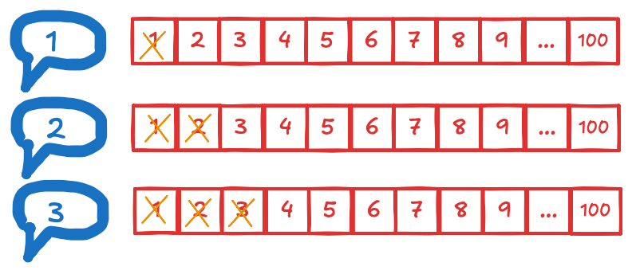
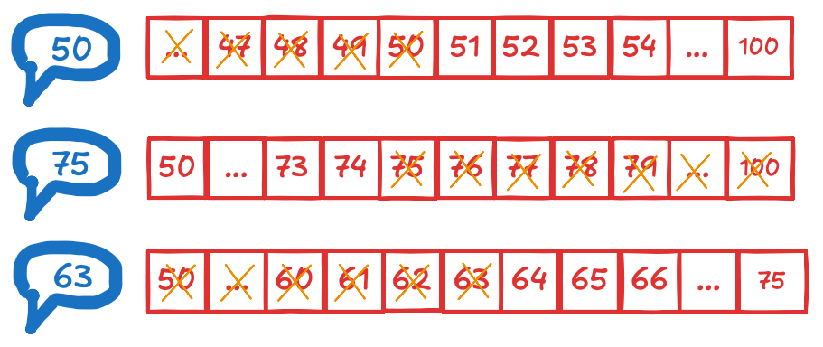

## Binary Search

### Explicação

Imaginando um cenário de 1..100 de uma lista ordenada, onde precisamos 
achar o numero 67, uma busca simples seria da maneira a seguir:



Dessa forma, a cada tentativa eliminamos apenas 1 número. Mas e e se houvesse 
uma maneira mais inteligente de se buscar um dado em uma lista ordenada?
Observe a maneira a seguir:



Como observamos na imagem, a cada chute intermediário removemos 
metade dos números restantes!

Imagine que estamos procurando 1 palavra em um dicionário com 240.000 palavras:

```
240K --> 120K --> 60K --> 30K --> 15K --> 7.5K --> 3750 --> 1875 --> 938 --> 469 --> 235 --> 118 --> 59 --> 30 --> 15 --> 8 -->  4 --> 2 --> 1
```
Usando a busca binária no pior dos casos para esse cenário teriam 18 etapas, contra em uma busca simples de 240.000 etapas.

### Implementação

